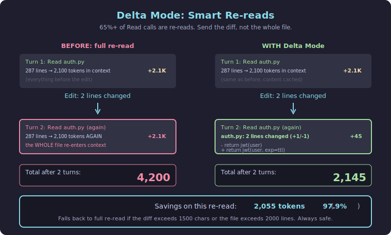
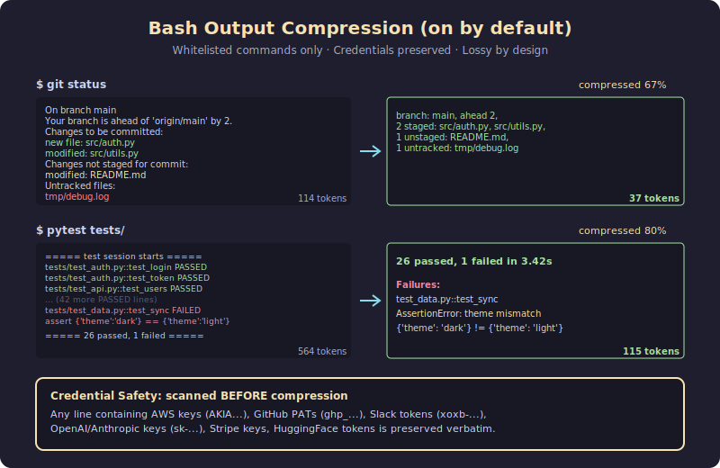

<p align="center">
  
</p>

<p align="center">
  <a href="https://github.com/alexgreensh/token-optimizer/releases"></a>
  <a href="https://github.com/alexgreensh/token-optimizer"></a>
  <a href="https://github.com/alexgreensh/token-optimizer/tree/main/openclaw"></a>
  <a href="https://github.com/alexgreensh/token-optimizer/blob/main/LICENSE"></a>
  <a href="https://github.com/alexgreensh/token-optimizer/stargazers"></a>
  <a href="https://github.com/alexgreensh/token-optimizer/commits/main"></a>
  
  
  <a href="https://linkedin.com/in/alexgreensh"></a>
  <a href="https://github.com/sponsors/alexgreensh"></a>
</p>

<h2 align="center">Your AI is getting dumber and you can't see it.</h2>

<p align="center"><em>Find the ghost tokens. Survive compaction. Track the quality decay.</em></p>

<p align="center">
Opus 4.6 drops from 93% to 76% accuracy across a 1M context window. Compaction loses 60-70% of your conversation. Ghost tokens burn through your plan limits on every single message. Token Optimizer tracks the degradation, cuts the waste, checkpoints your decisions before compaction fires, and tells you what to fix.
</p>

<p align="center">
  
</p>

## Install

```bash
/plugin marketplace add alexgreensh/token-optimizer
/plugin install token-optimizer@alexgreensh-token-optimizer
```

Then in Claude Code: `/token-optimizer`

> **Please enable auto-update after installing.** Claude Code ships third-party marketplaces with auto-update **off by default**, and plugin authors cannot change that default. So you won't get bug fixes automatically unless you turn it on. In Claude Code: `/plugin` → **Marketplaces** tab → select `alexgreensh-token-optimizer` → **Enable auto-update**. One-time, 10 seconds, and you'll never miss a fix again. Token Optimizer also prints a one-time reminder on your first SessionStart so you don't forget.

Also available as a script install, which auto-updates daily via `git pull --ff-only` with no toggles required:

```bash
git clone https://github.com/alexgreensh/token-optimizer.git ~/.claude/token-optimizer
bash ~/.claude/token-optimizer/install.sh
```

Works on Claude Code and [OpenClaw](#openclaw-plugin). Each platform gets its own native plugin (Python for Claude Code, TypeScript for OpenClaw). No bridging, no shared runtime, zero cross-platform dependencies.

## What makes this different?

`/context` tells you your context is 73% full. Token Optimizer tells you WHY,
shows you which 12K tokens are wasted on skills you never use, finds the 47
orphaned topic files in your MEMORY.md that Claude can't see, checkpoints your
decisions before compaction destroys them, and gives you a quality score that
tracks how much dumber your AI is getting as the session goes on.

One shows the dashboard light. The other opens the hood.

## Why install this first?

Every Claude Code session starts with invisible overhead: system prompt, tool definitions, skills, MCP servers, CLAUDE.md, MEMORY.md. A typical power user burns 50-70K tokens before typing a word.

At 200K context, that's 25-35% gone. At 1M, it's "only" 5-7%, but the problems compound:

- **Quality degrades as context fills.** MRCR drops from 93% to 76% across 256K to 1M. Your AI gets measurably dumber with every message.
- **You hit rate limits faster.** Ghost tokens count toward your plan's usage caps on every message, cached or not. 50K overhead x 100 messages = 5M tokens burned on nothing.
- **Compaction is catastrophic.** 60-70% of your conversation gone per compaction. After 2-3 compactions: 88-95% cumulative loss. And each compaction means re-sending all that overhead again.
- **Higher effort = faster burn.** More thinking tokens per response means you hit compaction sooner, which means more total tokens consumed across the session.

Token Optimizer tracks all of this. Quality score, degradation bands, compaction loss, drift detection. Zero context tokens consumed (runs as external Python).



> **"But doesn't removing tokens hurt the model?"** No. Token Optimizer removes structural waste (duplicate configs, unused skill frontmatter, bloated files), not useful context. It also actively *measures* quality: the 7-signal quality score tells you if your session is degrading, and Smart Compaction checkpoints your decisions before auto-compact fires. Most users see quality scores *improve* after optimization because the model has more room for real work.

---

## What It Does

One command. Six parallel agents audit your entire setup. Prioritized fixes with exact token savings. Everything backed up before any change.



You see diffs. You approve each fix. Nothing irreversible.

---

## What questions can you ask?

| Command | What You Get |
|---------|-------------|
| `quick` | **"Am I in trouble?"** 10-second answer: context health, degradation risk, biggest token offenders, which model to use. |
| `doctor` | **"Is everything installed correctly?"** Score out of 10. Broken hooks, missing components, exact fix commands. |
| `drift` | **"Has my setup grown?"** Side-by-side comparison vs your last snapshot. Catches config creep before it costs you. |
| `quality` | **"How healthy is this session?"** 7-signal analysis of your live conversation. Stale reads, wasted tokens, compaction damage. |
| `report` | **"Where are my tokens going?"** Full per-component breakdown. Every skill, every MCP server, every config file. |
| `conversation` | **"What happened each turn?"** Per-message token + cost breakdown with spike detection. |
| `pricing-tier` | **"What am I paying?"** View or switch between Anthropic/Vertex/Bedrock pricing tiers. |
| `kill-stale` | **"Clean up zombies."** Terminate headless sessions running 12+ hours. |
| `git-context` | **"What files matter right now?"** Test companions, co-changed files, import chains for your current git diff. |
| `trends` | **"What's actually being used?"** Skill adoption, model mix, overhead trajectory over time. |
| `coach` | **"Where do I start?"** Health score with earned vs neutral signals. Detects anti-patterns, shows what's working, flags what's not. |
| `memory-review` | **"Is my MEMORY.md broken?"** Structural audit: orphaned files, broken links, invisible entries past line 200, duplicate rules, stale content. Shows exactly what to fix and how many tokens you'd save. |
| `dashboard` | **"Show me everything."** Interactive HTML dashboard with all analytics, CLAUDE.md/MEMORY.md health cards, staleness warnings. |
| `savings` | **"How much have I saved?"** Cumulative dollar savings from optimizations, checkpoint restores, and archives. |
| `attention-score` | **"Is my CLAUDE.md well-structured?"** Scores sections against the attention curve, flags critical rules in low-attention zones. |
| `jsonl-inspect` | **"What's in this session?"** Record counts, token distribution, top 10 largest records, compaction markers. |
| `expand` | **"Get that result back."** Retrieves tool results archived before compaction. Never re-run a command twice. |
| `/token-optimizer` | **"Fix it for me."** Interactive audit with 6 parallel agents. Guided fixes with diffs and backups. |

---

## Quality Scoring

Seven signals, weighted to reflect real-world impact:

| Signal | Weight | What It Means For You |
|--------|--------|----------------|
| **Context fill** | 20% | How close are you to the degradation cliff? Based on published MRCR benchmarks. |
| **Stale reads** | 20% | Files you read earlier have changed. Your AI is working with outdated info. |
| **Bloated results** | 20% | Tool outputs that were never used. Wasting context on noise. |
| **Compaction depth** | 15% | Each compaction loses 60-70% of your conversation. After 2: 88% gone. |
| **Duplicates** | 10% | The same system reminders injected over and over. Pure waste. |
| **Decision density** | 8% | Are you having a real conversation or is it mostly overhead? |
| **Agent efficiency** | 7% | Are your subagents pulling their weight or just burning tokens? |

### Efficiency Grades

Every quality score includes a letter grade for quick triage. The status line shows something like `ContextQ:A(82)`, and the same grade appears in the dashboard, coach tab, and CLI output.

| Grade | Range | Meaning |
|-------|-------|---------|
| **S** | 90-100 | Peak efficiency. Everything is clean. |
| **A** | 80-89 | Healthy. Minor optimization possible. |
| **B** | 70-79 | Degradation starting. Worth investigating. |
| **C** | 60-69 | Significant waste. Coach mode will help. |
| **D** | 50-59 | Serious problems. Multiple anti-patterns likely. |
| **F** | 0-49 | Context is rotting. Immediate action needed. |

### Degradation Bands

The status bar shifts color as your context fills:

- Green (<50% fill): peak quality zone
- Yellow (50-70%): degradation starting
- Orange (70-80%): quality dropping
- Red (80%+): severe, consider /clear

### What Degradation Actually Looks Like

This is a real session. 708 messages, 2 compactions, 88% of the original context gone. Without the quality score, you'd have no idea.



---

## Smart Compaction: Don't Lose Your Work

When auto-compact fires, 60-70% of your conversation vanishes. Decisions, error-fix sequences, agent state: gone. Smart Compaction saves all of it as checkpoints before compaction, then restores what the summary dropped.

```bash
python3 measure.py setup-smart-compact    # checkpoint + restore hooks
```

### Progressive Checkpoints

Rather than waiting for emergency compaction, Token Optimizer captures session state at multiple thresholds: `20%`, `35%`, `50%`, `65%`, and `80%` context fill, plus quality drops below `80`, `70`, `50`, and `40`. It also snapshots before agent fan-out and after large edit batches. On restore, it picks the richest eligible checkpoint, not just the most recent one.

Background guards handle one-shot threshold capture, cooldown suppression, and deterministic extraction. No LLM calls in the checkpoint path.

### Tool Result Archive

The PostToolUse hook archives large tool results (>4KB) to disk. After compaction, use `expand <tool-use-id>` to retrieve any archived result instead of re-running the command. MCP tool results over 8KB get automatically trimmed with an expand hint.

```bash
python3 measure.py expand --list                 # List all archived tool results
python3 measure.py expand <tool-use-id>          # Retrieve a specific archived result
```

### Session Continuity

Sessions auto-checkpoint on end, /clear, and crashes. On a fresh session, Token Optimizer offers a pointer to the most recent relevant checkpoint instead of auto-injecting old context.

Enable optional local-only checkpoint telemetry to see whether checkpoints are firing and which triggers are active:

```bash
TOKEN_OPTIMIZER_CHECKPOINT_TELEMETRY=1 python3 measure.py checkpoint-stats --days 7
```

---

## Active Compression (v5)

Token Optimizer no longer just measures context bloat — it actively reduces it. Five features that each target a specific waste pattern, with honest risk assessment and dashboard toggles.



**What's on by default:** Quality Nudges, Loop Detection, and Delta Mode. Opt-in: Bash Compression and Structure Map Beta (local measurement only).

**All five features are independently toggleable** from the Manage tab in the dashboard, via CLI (`measure.py v5 enable|disable <feature>`), or with environment variables.

> **Privacy first:** Every feature runs **100% on your machine**. Zero network calls. Zero phone-home. Zero analytics endpoint. When this doc says "measurement" or "telemetry," it means **local SQLite writes to a file you own** (`~/.claude/_backups/token-optimizer/trends.db`). You can `sqlite3` it, export it, delete it, or never look at it. It's yours.

| Feature | Default | Potential Savings | Risk |
|---|---|---|---|
| Quality Nudges | **ON** | ~5% (prevented waste) | None |
| Loop Detection | **ON** | ~8% (caught loops) | None |
| Delta Mode | **ON** | ~20% (smart re-reads) | Low |
| Structure Map Beta (Local-Only Measurement) | OFF (opt-in) | Measurement only | None |
| Bash Compression | OFF (opt-in) | ~10% (CLI output) | Moderate |

> **Privacy note:** Every feature above runs 100% on your machine. Nothing is ever sent anywhere — no analytics endpoint, no phone-home, no cloud sync. "Measurement" and "beta telemetry" in this doc always mean **local-only SQLite writes to your own machine** that you can inspect, export, or delete at any time. Token Optimizer has zero network calls by design.



### Quality Nudges (ON by default)

Watches your context quality in real time. When the score drops 15+ points or crosses below 60, injects a one-line warning into context: `[Token Optimizer] Quality dropped to 58. Consider /compact to protect context.`

**Value:** Catches context rot early so you can /compact at the right moment, before you lose decisions to compaction. Prevents silent quality loss that leads to bad AI decisions.

**How it works:** Runs inside the existing quality-cache hook on every UserPromptSubmit. Cooldown of 5 minutes between nudges, max 3 per session. Suppressed on the first check after a compaction (so you don't get warned about quality you just fixed).

**Risk:** None. Only adds a short warning to context, never removes anything.

### Loop Detection (ON by default)

Detects when the AI is stuck retrying the same thing and warns you before it burns through tokens. A single caught loop typically saves 10-50K tokens.

**Value:** Catches loops before they burn through tokens. Post-hoc detectors found that loop sessions average 47K wasted tokens. Real-time detection prevents this.

**How it works:** Compares the last 4 user messages and last 5 tool results for similarity. Fires at confidence ≥0.7 with a session cap of 2 warnings (no meta-loop on loop detection itself). Uses fixed message templates — never echoes user content back.

**Risk:** None. Only adds a short warning to context, never removes anything.



### Delta Mode (ON by default — your biggest single win)

When the AI re-reads a file after editing it, shows only what changed instead of the whole file. Analysis of real sessions shows 65%+ of Read calls are re-reads, making this the highest-impact v5 feature.

**Value:** Typical sessions re-read the same file 2-5 times. Delta mode sends only the diff. A 2,000-token file re-read becomes a 50-token diff — 97% savings on that specific read.

**How it works:** Stores file content (up to 50KB per file) in a local cache on first read. On re-read with changed mtime, computes a unified diff via Python's `difflib` (stdlib, no git dependency). Falls back to full re-read if the diff exceeds 1,500 chars or either file exceeds 2,000 lines. `.env` and credential files are excluded from caching.

**Risk:** Low. If the AI needed the full file to understand the change in context, the diff alone might not be enough. Fails open on large changes and big files. Set `TOKEN_OPTIMIZER_READ_CACHE_DELTA=0` to disable if you hit edge cases.

### Structure Map Beta — Local-Only Measurement (OFF by default)

Writes measurement events to **your local SQLite database** when a code file is read multiple times and gets replaced with a function/class summary. The feature itself already runs in `soft_block` mode — this flag just adds measurement so you can see if it actually helped on your sessions.

**Not telemetry in the cloud sense.** Nothing is sent anywhere. Events land in `~/.claude/_backups/token-optimizer/trends.db` on your machine only. You can inspect with `sqlite3`, export, or delete at any time. Token Optimizer has zero network calls.

**Value:** Helps you prove (or disprove) whether structure maps help on your code-heavy sessions. Run `measure.py compression-stats --days 30` after a few weeks to see.

**How to enable:** `measure.py v5 enable structure_map_beta` or `TOKEN_OPTIMIZER_STRUCTURE_MAP=beta`

**Risk:** None. Adds a local SQLite row per event. Nothing else.



### Bash Output Compression (OFF — opt-in, lossy)

Rewrites common CLI commands (`git status`, `git log`, `git diff`, `pytest`, `npm install`, `ls`) to return compressed summaries instead of verbose output. Benchmarks show 38% average compression with 100% credential preservation.

**Value:** Strips hundreds of lines of test/build/git output down to just the essentials. A 564-token pytest output becomes 115 tokens. A 60-file `ls -la` truncates to 50. Best for sessions with lots of CLI commands.

**How it works:** A PreToolUse hook (`bash_hook.py`) intercepts safe read-only commands, tokenizes them with `shlex.split()`, checks against a whitelist, and rewrites them via `updatedInput` to route through a compression wrapper (`bash_compress.py`). Categorically excludes compound commands (anything with `;`, `&&`, `||`, `|`, `$()`, backticks, `>`, `>>`), sudo, and interactive flags.

**Security:** `shell=True` is never used. Credentials (AWS keys, GitHub PATs, Slack tokens, Stripe keys, OpenAI keys) are scanned PRE-compression and preserved verbatim. Partial output on timeout is returned raw, never compressed.

**How to enable:** `measure.py v5 enable bash_compress` or `TOKEN_OPTIMIZER_BASH_COMPRESS=1`

**Risk:** Moderate. Compression is lossy by design — `git diff` truncates to 30 lines on large diffs, `pytest` strips individual passing test names, `git log` drops merge commit details. For routine checks this is fine. For careful diff review or debugging specific test failures, it could hide information. **OFF by default — opt-in only.**

### Managing v5 features

Three ways to control these features:

```bash
# CLI
python3 measure.py v5 status                    # show all features with current state
python3 measure.py v5 enable delta_mode         # turn a feature on
python3 measure.py v5 disable bash_compress     # turn a feature off
python3 measure.py v5 info delta_mode           # show full details for one feature
python3 measure.py v5 welcome                   # show the first-run welcome screen
python3 measure.py compression-stats            # see actual measured savings from local telemetry
```

```bash
# Environment variables (override config.json, for CI/scripts)
TOKEN_OPTIMIZER_QUALITY_NUDGES=0        # kill switch for nudges
TOKEN_OPTIMIZER_LOOP_DETECTION=0        # kill switch for loop detection
TOKEN_OPTIMIZER_READ_CACHE_DELTA=1      # enable delta mode
TOKEN_OPTIMIZER_BASH_COMPRESS=1         # enable bash compression
TOKEN_OPTIMIZER_STRUCTURE_MAP=beta      # enable beta telemetry
```

**Dashboard:** Open `token-dashboard` → Manage tab. Active Compression (v5) is the first section. Toggles apply instantly to new tool calls — no Claude Code restart needed. Each feature shows what it does, its value, how it works, its risk level, and its impact estimate.

**First-run welcome:** On your first session after installing v5, you'll see a one-time welcome screen explaining each feature, its default state, and how to toggle it. Stored in `config.json` so it only shows once.

### Measuring real savings (all local)

All v5 features log to a `compression_events` SQLite table stored **locally** on your machine at `~/.claude/_backups/token-optimizer/trends.db`. Nothing leaves your system.

```bash
python3 measure.py compression-stats --days 30
```

Output shows total events per feature, tokens saved, compression ratio, and quality preservation rate. The `verified` flag distinguishes exact measurements (delta mode knows the precise before/after) from estimates (structure map is heuristic).

**Privacy note:** Every measurement, every event, every byte of telemetry is stored on your machine only. Token Optimizer has no network calls, no phone-home, no analytics endpoint. The `compression-stats` command reads your local SQLite database and prints to your terminal — nothing more.

---

## Live Quality Bar: Know Before It's Too Late

A glance at your terminal tells you if you're in trouble. Colors shift from green to red as quality degrades. When quality drops below 75, session duration appears as a warning. Running subagents show with their model and elapsed time so you can spot misrouted models.



```bash
python3 measure.py setup-quality-bar      # one-time install
```

**My quality bar disappeared, how do I get it back?** Running Claude Code's built-in `/statusline` rewrites the `statusLine` key in `~/.claude/settings.json` and silently overwrites Token Optimizer's entry. SessionStart detects this and **auto-restores** the quality bar. Just start a new session and it's back. You'll see a one-line notice explaining what happened.

**I really don't want the quality bar anymore, how do I turn it off for good?** Run:

```bash
python3 measure.py setup-quality-bar --uninstall
```

This removes the components **and** writes `quality_bar_disabled: true` to `~/.claude/token-optimizer/config.json`. The opt-out is sticky across sessions. SessionStart will not auto-restore it. You can also just tell Claude Code in natural language: _"remove the Token Optimizer statusline"_, and Claude will run the uninstall command for you.

**I changed my mind, bring it back.** Run `python3 measure.py setup-quality-bar`. Explicit install clears the opt-out flag automatically.

**I want to keep my own custom statusline and also see the quality score.** The custom-statusline path is still respected when you run `setup-quality-bar` directly. You'll get integration instructions for reading `~/.claude/token-optimizer/quality-cache.json` from your own script instead.

---

## Interactive Dashboard

After the audit, you get an interactive HTML dashboard.


Every component is clickable. Expand any item to see why it matters, what the trade-offs are, and what changes. Toggle the fixes you want, and copy a ready-to-paste optimization prompt.

### What the Dashboard Shows

Click any session to see a per-turn breakdown of input, output, and cache tokens for each API call, with spike detection highlighting context jumps. Each session shows estimated API cost across four pricing tiers (Anthropic API, Vertex Global, Vertex Regional, AWS Bedrock). Set your tier once and all costs update.

Cache visualization uses stacked bars to show input vs output vs cache-read vs cache-write split, with TTL mix (`1h` vs `5m`) shown alongside hit metrics. Session rows include pacing metrics (time between calls) so you can see whether a thread was steady or stop-start. Hover help on columns explains `Cache`, `TTL`, `Pacing`, `Cache R`, and `Cache W` without jargon.

Color-coded quality scores overlay every session: green for healthy, yellow for degrading, red for trouble. Session drill-downs key off stable session identity for consistent expansion.

### Persistent Dashboard

The dashboard auto-regenerates after every session (via the SessionEnd hook). Bookmark it and it's always up to date.

```bash
python3 measure.py setup-daemon     # Bookmarkable URL at http://localhost:24842/token-optimizer
python3 measure.py dashboard --serve # One-time serve over HTTP
```

---

## Usage Analytics

**Trends**: Which skills do you actually invoke vs just having installed? Which models are you using? How has your overhead changed over time?

**Session Health**: Catches stale sessions (24h+), zombie sessions (48h+), and outdated configurations before they cause problems.

```bash
python3 measure.py setup-hook       # Enable session tracking (one-time)
python3 measure.py trends           # Usage patterns over time
python3 measure.py health           # Session hygiene check
python3 measure.py plugin-cleanup   # Detect duplicate skills + archive local/plugin overlaps
```

---

## Memory Health: Your MEMORY.md Is Probably Broken

Claude auto-loads the first 200 lines of MEMORY.md every session. Everything after line 200 is silently truncated. The tokens still count against your window, but Claude never sees the content. Most power users don't know this is happening.

`memory-review` scans your MEMORY.md structurally and tells you what's wrong:

- **Orphaned topic files**: files in your memory directory that nothing links to
- **Broken links**: index entries pointing to files that don't exist
- **Invisible entries**: content below line 200 that Claude can't see (and the topic files they point to)
- **Inline content**: notes that should be in topic files, wasting index budget
- **Duplicate rules**: rules already in CLAUDE.md (which loads in full regardless)
- **Stale entries**: resolved/superseded content still taking up space
- **Task leakage**: TODO lists and checklists that belong in a task tracker

```bash
python3 measure.py memory-review                        # Full structural audit
python3 measure.py memory-review --json                 # Machine-readable for dashboards
python3 measure.py memory-review --apply                # Show actionable fixes
python3 measure.py memory-review --stale-days 90        # Custom staleness threshold
```

The dashboard shows CLAUDE.md Health and MEMORY.md Health cards on the Overview tab, with line count, orphan count, and status at a glance.

For contradiction detection (two rules saying opposite things), run the audit in a Claude session. The tool extracts all NEVER/ALWAYS/MUST rules from both files. Claude reviews them semantically in context, no extra LLM call needed.

---

## Coach Mode: Not Sure Where to Start?

```
> /token-coach
```

Tell it your goal. Get back specific, prioritized fixes with exact token savings. Detects 8 named anti-patterns (The Kitchen Sink, The Hoarder, The Monolith...) and recommends multi-agent design patterns that actually save context.

### Waste Detectors

9 automated detectors analyze your session patterns and surface actionable findings:

| Detector | What it catches |
|---|---|
| PDF/binary ingestion | Large files consuming context (warns with token estimate) |
| Web search overhead | Too many web results dumped into context |
| Retry churn | Same tool retried 3+ times with errors |
| Tool cascade | 3+ consecutive tool errors in a chain |
| Looping | Repeated similar messages (stuck model) |
| Overpowered model | Opus used for simple edits (with "if Sonnet: $X saved") |
| Weak model | Haiku on complex tasks needing a stronger model |
| Bad decomposition | Monolithic 500+ word prompts doing too much |
| Wasteful thinking | Extended thinking >2x output for small edits |

### Subagent Cost Breakdown

See exactly how much your subagents cost: total spend, % of combined budget, and top offenders ranked by cost. Flags when subagents consume >30% of total.

### Costly Prompt Ranking

See which prompts cost the most: pairs each user message with the cost of the response, ranks top 5. Shows what you asked, not just totals.

### CLAUDE.md Routing Injection

Generate model routing instructions from your actual usage data and inject them into CLAUDE.md. Claude reads these every session and routes accordingly. A 48-hour staleness guard auto-removes stale advice. Run on demand when you want to update your routing guidance.

```bash
python3 measure.py inject-routing --dry-run   # Preview what would be injected
python3 measure.py inject-routing              # Inject (with approval)
```

---

## Read-Cache and Context Tools

### PreToolUse Read-Cache

Detects redundant file reads and optionally blocks them with structural digests. Default ON in warn mode. Saves 8-30% tokens from read deduplication.

```bash
# Read-cache is ON by default (warn mode). To disable:
export TOKEN_OPTIMIZER_READ_CACHE=0               # Disable
export TOKEN_OPTIMIZER_READ_CACHE_MODE=block       # Upgrade to block mode

# Read-cache management
python3 measure.py read-cache-stats --session ID   # Cache stats for a session
python3 measure.py read-cache-clear                # Clear all caches
```

Opt out entirely with `TOKEN_OPTIMIZER_READ_CACHE=0` or config `{"read_cache_enabled": false}`. Upgrade to `TOKEN_OPTIMIZER_READ_CACHE_MODE=block` after gaining confidence.

### Git-Aware Context

Analyzes your working tree to suggest files that should be in context: test companions, frequently co-changed files from last 50 commits, and import chains for Python/JS/TS.

```bash
python3 measure.py git-context                     # Suggest files for current changes
python3 measure.py git-context --json              # Machine-readable output
```

### .contextignore

Block files from being read with gitignore-style patterns. Supports project root `.contextignore` and global `~/.claude/.contextignore`. Hard block regardless of read-cache mode. This is provided by Token Optimizer, not a built-in Claude Code feature.

```
# Block build artifacts and lockfiles
dist/**
node_modules/**
package-lock.json
yarn.lock
*.min.js
*.min.css
```

### Attention Optimizer

Scores CLAUDE.md against the U-shaped attention curve. Flags critical rules (NEVER/ALWAYS/MUST) sitting in the low-attention zone (30-70% position). Generates a reordered version that moves critical rules to high-attention zones.

```bash
python3 measure.py attention-score               # Score CLAUDE.md attention placement
python3 measure.py attention-optimize --dry-run  # Preview optimized section order
```

### JSONL Toolkit

Three utilities for session JSONL files: `jsonl-inspect` (stats, record counts, largest records), `jsonl-trim` (replace large tool results with placeholders), `jsonl-dedup` (detect and remove duplicate system reminders). All use streaming I/O and atomic writes.

```bash
python3 measure.py jsonl-inspect                 # Stats on current session JSONL
python3 measure.py jsonl-trim --dry-run          # Preview trimming large tool results
python3 measure.py jsonl-dedup --dry-run         # Preview removing duplicate reminders
```

### Savings Tracking

Tracks cumulative dollar savings from setup optimization, checkpoint restores, and tool archiving.

```bash
python3 measure.py savings                      # Dollar savings report (last 30 days)
```

---

## How It Compares

| Capability | Token Optimizer | `/context` (built-in) | context-mode |
|---|---|---|---|
| Startup overhead audit | Deep (per-component) | Summary (v2.1.74+) | No |
| Quality degradation tracking | MRCR-based bands | Basic capacity % | No |
| Guided remediation | Yes, with token estimates | Basic suggestions | No |
| Runtime output containment | No | No | Yes (98% reduction) |
| Smart compaction survival | Progressive checkpoints + restore | No | Session guide |
| Tool result archive | Yes (cross-compaction recovery) | No | No |
| Dollar savings tracking | Yes (per-category breakdown) | No | No |
| JSONL session toolkit | Inspect, trim, dedup | No | No |
| Attention curve optimizer | Yes (CLAUDE.md reordering) | No | No |
| Waste pattern detection | 9 automated detectors | No | No |
| Subagent cost breakdown | Yes (ranked by $) | No | No |
| Costly prompt ranking | Yes (top 5 by cost) | No | No |
| Model recommendation | Yes (Sonnet vs Opus by context) | No | No |
| CLAUDE.md advice injection | Yes (with 48h TTL) | No | No |
| MEMORY.md structural audit | 8 detectors + fix suggestions | No | No |
| CLAUDE.md/MEMORY.md health cards | Dashboard overview | No | No |
| Validate optimization impact | Before/after comparison | No | No |
| Usage trends + dashboard | SQLite + interactive HTML | No | Session stats |
| Per-turn cost analytics | Yes (4 pricing tiers) | No | No |
| Compaction loss tracking | Yes (cumulative % lost) | No | Partial |
| Multi-platform | Claude Code + OpenClaw | Claude Code | 6 platforms |
| Context tokens consumed | 0 (Python script) | ~200 tokens | MCP overhead |

`/context` shows capacity. Token Optimizer fixes the causes.
context-mode prevents runtime floods. Token Optimizer prevents structural waste.

---

## VS Code Users

Using Claude Code in the VS Code extension? Most of Token Optimizer works identically:

| Feature | CLI | VS Code Extension |
|---------|-----|-------------------|
| Smart Compaction (checkpoint + restore) | Works | Works |
| Quality tracking + session data | Works | Works |
| All hooks (SessionEnd, PreCompact, etc.) | Works | Works |
| Dashboard (localhost:24842/token-optimizer) | Works | Works |
| Status line (quality bar in terminal) | Works | Not available |

**The status line is CLI-only.** The VS Code extension doesn't support Claude Code's `statusLine` setting. This is a Claude Code limitation, not a Token Optimizer limitation.

**Best options for VS Code:**
- **Dashboard**: Bookmark `http://localhost:24842/token-optimizer` for always-current analytics. Run `python3 measure.py setup-daemon` to enable auto-refresh after every session.
- **Integrated terminal**: Run `claude` in VS Code's built-in terminal to get the full CLI experience, including the quality bar.
- **VS Code extension**: On the roadmap. [Follow #3](https://github.com/alexgreensh/token-optimizer/issues/3) for updates.

> **Note on `--bare` mode**: Running Claude Code with the `--bare` flag (for scripted/CI usage) skips all hooks and plugin sync. Token Optimizer's Smart Compaction, quality tracking, and session data collection require hooks and won't activate in `--bare` mode. This is expected, `--bare` is designed for lightweight scripted calls.

---

## OpenClaw Plugin

Native TypeScript plugin for OpenClaw agent systems. Zero Python dependency. Works with any model (Claude, GPT-5, Gemini, DeepSeek, local via Ollama). Reads your OpenClaw pricing config for accurate cost tracking, falls back to built-in rates for 20+ models.

```bash
# From GitHub (recommended)
openclaw plugins install github:alexgreensh/token-optimizer

# From ClawHub
openclaw plugins install token-optimizer

# From source
git clone https://github.com/alexgreensh/token-optimizer
cd token-optimizer/openclaw && npm install && npm run build
openclaw plugins install ./
```

Inside OpenClaw, run `/token-optimizer` for a guided audit with coaching.

**What it does:** Session parsing, cost calculation, waste detection (9 detectors including unused skill detection), Coach tab with health scoring, per-turn token breakdown with cache analysis, costly prompt ranking, agent cost analysis (orchestrator vs worker), topic extraction, and Smart Compaction (checkpoint/restore across compaction events).

**What's different from Claude Code:** The OpenClaw plugin includes its own 7-signal ContextQ with signals native to OpenClaw's architecture (Message Efficiency, Compression Opportunity, Model Routing, etc.) rather than a direct port of Claude Code's signals. The Coach tab adapts scoring to OpenClaw concepts (SOUL.md instead of CLAUDE.md, agent configs instead of hooks). Works with any model: Claude, GPT-5, Gemini, DeepSeek, local via Ollama.

See [`openclaw/README.md`](openclaw/README.md) for full docs.

---

## License

**PolyForm Noncommercial 1.0.0**. Free for personal, research, educational, and non-commercial use. Commercial use requires a separate license. Contact [Alex Greenshpun](https://linkedin.com/in/alexgreensh) for commercial licensing.

Created by [Alex Greenshpun](https://linkedin.com/in/alexgreensh).
